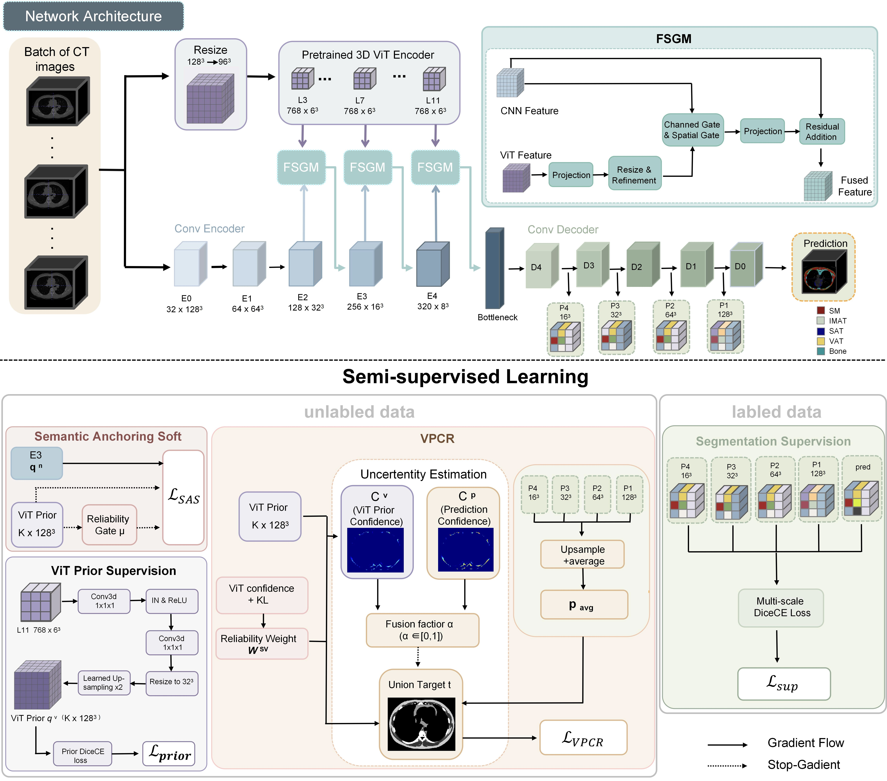

# Pretrained CT Semantic Priors for Label-Efficient Body Composition Segmentation via Hierarchical Regularization

This repository is a implementation of the segmentation network
from the paper **Pretrained CT Semantic Priors for Label-Efficient Body
Composition Segmentation via Hierarchical Regularization**. It follows the
implementation style of nnUNet but is written from scratch (convolutional U-Net
+ frozen 3D ViT + gated fusion), behaves identically to the original, depends
only on PyTorch, and contains no config files or weight files.



## Quick Start

```bash
pip install torch

python demo.py            # full-config forward check (128³ input, ~3–4 GB memory)
python demo.py --size 96  # use 96³ input if memory is limited
python demo.py --quick    # small config, runs in seconds
```

## File Structure

| File | Content |
|---|---|
| `unet.py` | Convolutional U-Net backbone |
| `transformer.py` | 3D ViT backbone |
| `fusion.py` | ViT-to-convolution gated fusion module |
| `network.py` | Main network `HybridUNet` |
| `demo.py` | Build the network and verify the forward pass |

